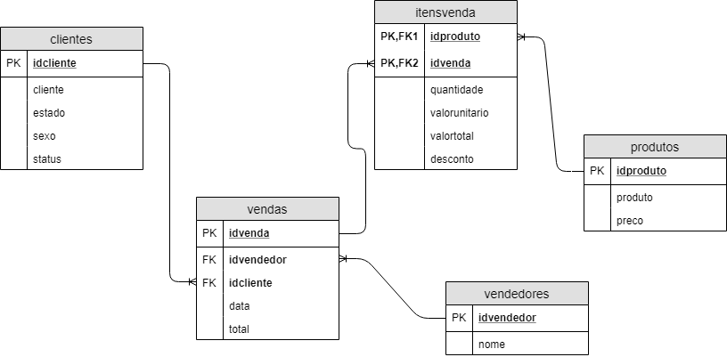

# comandos para interagir com o Postgres #

### Logar no postgres ###
sudo -u postgres psql 

### Criando banco de dados ###
create database ed;

### listar bancos ###
\list

### Alterar banco de dados ###
\c ed

### Rodar os scripts externos de criação de tabela ###
- \i path do arquivo sql 
\i /workspace/downloads//1.CreateTable.sql
- insira todos os códigos para criação das tabelas e para incessão de dados [1:6]

### SQL ###
- Ctrl+l - limpar a tela do terminal 
- Agora você pode fazer suas consultas no banco Postgres relacional 

### Outros comandos ###
\q volta ao terminal do linux

